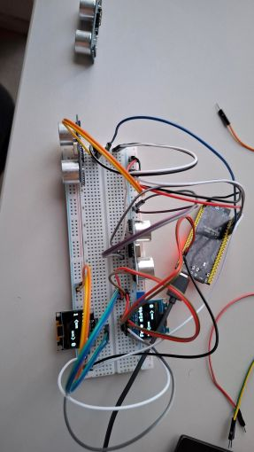

# Table of Contents
1. [Introduction](#introduction)
2. [Folder Structure and Purpose](#folder-structure-and-purpose)
3. [Code Realization](#code-realization)
4. [Implementation of the Wiring (Image Description)](#implementation-of-the-wiring-image-description)
5. [Conclusion and Recommendation](#conclusion-and-recommendation)

# Introduction
This document describes the implementation of the hardware-related code in the `Niklas` folder (excluding Wifi) for the parking tile project. It explains the folder structure, the realization of the code, and how the wiring is reflected in both the schematic and the software. The goal is to provide a clear understanding of the modular approach and its benefits for future development and maintenance.

# Implementation Details: Niklas Folder (excluding Wifi)

## Folder Structure and Purpose
The `Niklas` folder contains modular code for different hardware components used in the parking tile project. Each subfolder encapsulates a specific functionality:

- **LightSensor**: Contains code for a light-dependent resistor (LDR) sensor with LED feedback. The sensor reads ambient light and switches an LED on or off depending on a configurable threshold.
- **oledScreen**: Provides a reusable class for controlling an SSD1306 OLED display via I2C. It supports printing text with alignment options and displaying parking slot information.
- **ParkingLot**: Manages individual parking slots, using an ultrasonic sensor to detect if a slot is free and controlling status LEDs accordingly.
- **UltraSonicSensor**: Encapsulates the logic for distance measurement using an ultrasonic sensor.

## Code Realization
- Each hardware component is implemented as a C++ class, making the code modular and reusable.
- Pin assignments and thresholds are passed as constructor parameters, allowing flexible hardware configuration.
- The main logic periodically reads sensor values and updates outputs (LEDs, display) based on the measured data.
- The OLED display is used to visualize the number of free parking slots, with clear and structured output.
- Serial output is used for debugging and monitoring sensor values.

## Implementation of the Wiring (Image Description)
The following image shows the wiring of the SSD1306 OLED display to the ESP32 microcontroller using the I2C protocol:

**Explanation:**
- The SDA and SCL lines of the OLED display are connected to the corresponding I2C pins of the ESP32.
- Power is supplied via VCC and GND.
- In the code, the I2C address and the SDA/SCL pins are passed to the `OledScreen` class, which initializes and manages the display.
- The wiring in the image matches the initialization and pin assignment in the code, ensuring correct communication between the ESP32 and the OLED display.

# Conclusion and Recommendation

**Conclusion:**
The modular design of the `Niklas` folder enables clear separation of hardware functionalities, making the codebase easy to understand, maintain, and extend. Each component can be developed and tested independently, which reduces complexity and potential errors.

**Recommendation:**
For future development, it is recommended to continue following this modular approach. New hardware features or sensors should be encapsulated in their own classes and folders. Consistent documentation and clear wiring diagrams will further support maintainability and collaboration within the team.