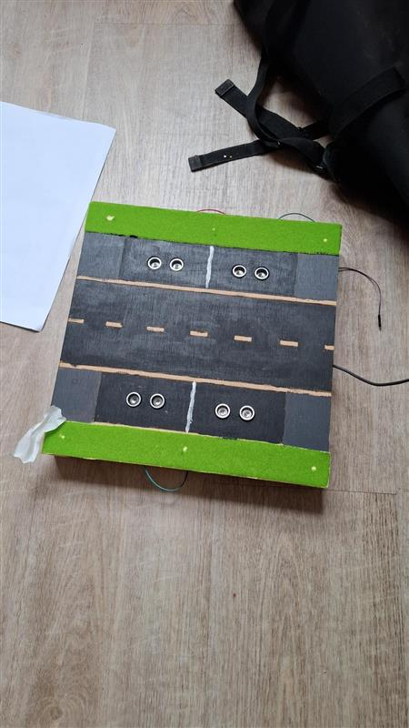
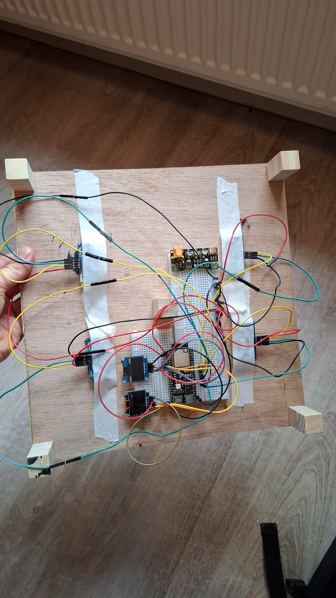

# Table of Contents
1. [Introduction](#introduction)
2. [Folder Structure and Purpose](#folder-structure-and-purpose)
3. [Code Realization](#code-realization)
4. [Implementation of the Wiring (Image Description)](#implementation-of-the-wiring-image-description)
5. [Conclusion and Recommendation](#conclusion-and-recommendation)

# Introduction
This document describes the implementation and updates of the hardware-related code in the `Niklas` folder for Sprint 3 of the parking tile project. It highlights the modular structure, new features, and improvements made to support more flexible and maintainable development.

# Folder Structure and Purpose

The [`Niklas` folder](../../../../esp/Niklas/) contains modular code for the main hardware components of the parking tile:

- **UltraSonicSensor**: Encapsulates the logic for distance measurement using ultrasonic sensors. ([UltraSonicSensor.cpp](../../../../../../../../esp/Niklas/UltraSonicSensor.cpp), [UltraSonicSensor.h](../../../../../../../../esp/Niklas/UltraSonicSensor.h))
- **ParkingSpace**: Manages individual parking slots, using an ultrasonic sensor to detect occupancy and controlling status LEDs. ([ParkingSpace.cpp](../../../../../../../../esp/Niklas/ParkingSpace.cpp), [ParkingSpace.h](../../../../../../../../esp/Niklas/ParkingSpace.h))
- **oledScreen**: Provides a class for controlling SSD1306 OLED displays via I2C, supporting dynamic display of parking slot information. ([oledScreen.cpp](../../../../esp/Niklas/oledScreen.cpp), [oledScreen.h](../../../../esp/Niklas/oledScreen.h))
- **ParkingTile**: Represents a group of parking spaces and manages their collective state and display output. ([ParkingTile.cpp](../../../../esp/Niklas/ParkingTile.cpp), [ParkingTile.h](../../../../esp/Niklas/ParkingTile.h))
- **backend**: Handles communication with the backend, including status updates and instruction reception. ([backend.cpp](../../../../esp/Niklas/backend.cpp), [backend.h](../../../../esp/Niklas/backend.h))
- **HelperMethod**: Contains utility functions for timing and other helper tasks. ([HelperMethod.cpp](../../../../esp/Niklas/HelperMethod.cpp), [HelperMethod.h](../../../../esp/Niklas/HelperMethod.h))
- **OperationEnumParkingSpace / OperationEnumParkingTile**: Enumerations for operation modes of parking spaces and tiles. ([OperationEnumParkingSpace.h](../../../../esp/Niklas/OperationEnumParkingSpace.h), [OperationEnumParkingTile.h](../../../../esp/Niklas/OperationEnumParkingTile.h))

# Code Realization
	- Each hardware component is implemented as a C++ class, supporting modularity and reusability.
	- The main sketch ([Niklas.ino](../../../../esp/Niklas/Niklas.ino)) initializes multiple ultrasonic sensors, parking spaces, OLED screens, and parking tiles.
- Pin assignments and configuration parameters are passed as constructor arguments, allowing flexible hardware setup.
- The system supports multiple OLED screens and parking tiles, making it scalable for larger installations.
- The main loop periodically updates sensor readings, updates the display, and (optionally) sends status updates to the backend.
- Test routines are included for simulating parking space occupancy and verifying backend communication.
- The backend module is prepared for integration with WiFi and MQTT, though these features can be toggled for testing.

# Implementation of the Wiring (Image Description)
The wiring connects multiple ultrasonic sensors and status LEDs to the ESP32, as well as one or more SSD1306 OLED displays via I2C (SDA/SCL). Each parking space is associated with a sensor and an RGB LED (red/green). The OLED screens display the number of free slots per side, and the wiring matches the pin assignments in the code.

# Conclusion and Recommendation

**Conclusion:**  
The Sprint 3 implementation further improves modularity and scalability. The codebase now supports multiple parking tiles and displays, with clear separation of concerns and flexible configuration. Backend integration is prepared for real-world deployment.

**Recommendation:**  
Continue to follow the modular approach for future features. Expand test coverage, document wiring for new hardware, and leverage the backend integration for real-time monitoring and control.
